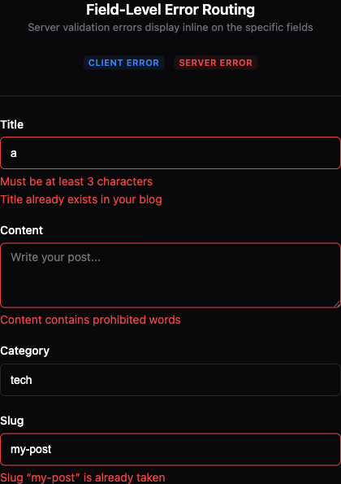

# Forms

Typesafe forms with Zod validation, multi-step wizards, auto-save, conflict detection, async validation, and field-level error routing.

## Field-Level Error Routing

Server-side validation errors from `errValidation` automatically display inline on the specific form fields that caused them — no extra code needed.



### How It Works

When a form submission fails server-side validation via `errValidation`, the thrown `ConvexError` includes a `fieldErrors` map (`Record<string, string>`). The `useForm` hook extracts these errors and passes them through `FormContext` as `serverErrors`. Each field component (`Text`, `Choose`, `Num`, etc.) automatically renders a `<ServerFieldError>` below the input when a matching server error exists.

```
errValidation (server) → ConvexError { fieldErrors } → useForm extracts → FormContext.serverErrors → <ServerFieldError> per field
```

### Zero Config — It Just Works

If your backend uses `errValidation`, field-level errors appear automatically on all lazyconvex form fields:

```tsx
// Backend — throws with fieldErrors
const result = schema.safeParse(args)
if (!result.success) errValidation('VALIDATION_FAILED', result.error)

// Frontend — errors display inline, no extra code
<Form form={form} render={f => (
  <>
    <f.Text name='title' label='Title' />
    <f.Text name='content' label='Content' multiline />
    <f.Submit>Save</f.Submit>
  </>
)} />
```

### `ServerFieldError` Component

For advanced use, `ServerFieldError` is exported for standalone use. It reads from `FormContext.serverErrors` and renders error text for a specific field.

#### Props

| Prop | Type | Description |
|------|------|-------------|
| `name` | `string` | Field name to look up in `serverErrors` |
| `className` | `string` | Custom CSS classes (overrides default styling) |
| `...props` | `ComponentProps<'div'>` | All standard `<div>` props forwarded |

#### Default Styling

Matches `FieldError` from `@a/ui`: `text-sm font-normal text-destructive` with `role='alert'` and `data-slot='server-field-error'`.

#### Customization Examples

```tsx
import { ServerFieldError } from 'lazyconvex/components'

// Default — matches FieldError styling
<ServerFieldError name='title' />

// Custom className
<ServerFieldError name='title' className='text-xs italic text-red-400' />

// Custom data attributes for testing
<ServerFieldError name='title' data-testid='title-server-error' />

// Inline style override (if needed)
<ServerFieldError name='email' className='mt-2 rounded bg-red-50 p-2 text-red-600' />
```

#### Standalone Usage (Outside Built-in Fields)

If you build custom field components, wrap them in `<FormContext>` and use `ServerFieldError` directly:

```tsx
import { FormContext, ServerFieldError } from 'lazyconvex/components'

const CustomField = ({ name }: { name: string }) => (
  <div>
    <input name={name} />
    <ServerFieldError name={name} />
  </div>
)
```

### `fieldErrors` in `useForm` Return

The `fieldErrors` state is also available directly from the `useForm` return value for programmatic access:

```tsx
const form = useForm({
  schema: blogSchema,
  onSubmit: async (data) => { /* ... */ }
})

// Access field errors programmatically
const titleError = form.fieldErrors.title
const hasErrors = Object.keys(form.fieldErrors).length > 0
```

### Error Precedence

Both client-side (Zod/tanstack-form) and server-side errors can appear simultaneously:

1. **Client-side errors** (`FieldError`) — shown when field is touched and invalid per Zod schema
2. **Server-side errors** (`ServerFieldError`) — shown when server returns `fieldErrors` after submission

Server errors are cleared automatically when the form is resubmitted or reset.
