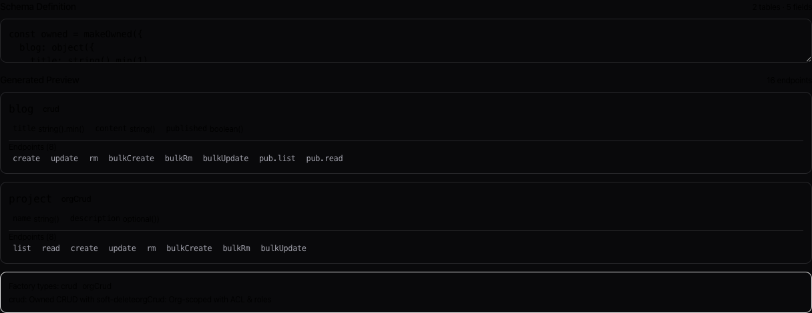

# API Reference

## Imports

| Module | Key Exports |
|--------|------------|
| `lazyconvex` | `guardApi`, `strictApi` |
| `lazyconvex/server` | `setup`, `ownedTable`, `orgTable`, `baseTable`, `singletonTable`, `childTable`, `orgChildTable`, `orgTables`, `uploadTables`, `rateLimitTable`, `orgCascade`, `ownedCascade`, `canEdit`, `getOrgMember`, `getOrgRole`, `requireOrgMember`, `requireOrgRole`, `handleConvexError`, `getErrorCode`, `getErrorMessage`, `getErrorDetail`, `extractErrorData`, `isErrorCode`, `isMutationError`, `isRecord`, `matchError`, `checkRateLimit`, `checkSchema`, `makeOrg`, `makeFileUpload`, `makePresence`, `presenceTable`, `err`, `ok`, `fail`, `time`, `composeMiddleware`, `auditLog`, `inputSanitize`, `slowQueryWarn` |
| `lazyconvex/test` | `makeTestAuth`, `makeOrgTestCrud`, `getOrgMembership`, `discoverModules`, `createTestContext`, `isTestMode`, `TEST_EMAIL` |
| `lazyconvex/react` | `createOrgHooks`, `useForm`, `useFormMutation`, `useList`, `useSearch`, `useInfiniteList`, `usePresence`, `useOptimisticMutation`, `useSoftDelete`, `useUpload`, `useBulkSelection`, `useCacheEntry`, `useMutate`, `useOnlineStatus`, `useErrorToast`, `makeErrorHandler`, `OrgProvider`, `OptimisticProvider`, `useOrg`, `useActiveOrg`, `useMyOrgs`, `useOrgQuery`, `useOrgMutation`, `canEditResource`, `setActiveOrgCookieClient`, `buildMeta`, `getMeta`, `useDevErrors`, `LazyConvexDevtools`, `SchemaPlayground`, `usePendingMutations`, `defaultOnError` |
| `lazyconvex/components` | `Form`, `defineSteps`, `EditorsSection`, `PermissionGuard`, `OfflineIndicator`, `OrgAvatar`, `RoleBadge`, `AutoSaveIndicator`, `ConflictDialog`, `ConvexErrorBoundary`, `FileApiProvider` |
| `lazyconvex/schema` | `child`, `cvFile`, `cvFiles`, `makeBase`, `makeOrgScoped`, `makeOwned`, `makeSingleton`, `orgSchema` |
| `lazyconvex/zod` | `unwrapZod`, `cvFileKindOf`, `cvMetaOf`, `defaultValue`, `defaultValues`, `elementOf`, `enumToOptions`, `isArrayType`, `isBooleanType`, `isDateType`, `isNumberType`, `isOptionalField`, `isStringType`, `pickValues`, `coerceOptionals`, `requiredPartial` |
| `lazyconvex/next` | `getActiveOrg`, `setActiveOrgCookie`, `clearActiveOrgCookie`, `getToken`, `isAuthenticated`, `makeImageRoute` |
| `lazyconvex/retry` | `withRetry`, `fetchWithRetry` |

## Error Codes

| Code | Meaning |
|------|---------|
| `NOT_AUTHENTICATED` | Not logged in |
| `NOT_FOUND` | Doesn't exist or not owned |
| `NOT_AUTHORIZED` | No permission |
| `CONFLICT` | Concurrent edit detected |
| `RATE_LIMITED` | Too many requests |
| `EDITOR_REQUIRED` | ACL edit permission required |
| `FILE_TOO_LARGE` | File exceeds size limit |
| `INVALID_FILE_TYPE` | File type not in allowlist |
| `VALIDATION_FAILED` | Zod validation error |
| `INSUFFICIENT_ORG_ROLE` | User lacks required org role |
| `ALREADY_ORG_MEMBER` | User is already an org member |
| `INVITE_EXPIRED` | Invite token has expired |
| `INVALID_INVITE` | Invite token is invalid |
| `ORG_SLUG_TAKEN` | Org slug already in use |

```tsx
import { handleConvexError } from 'lazyconvex/server'

handleConvexError(error, {
  NOT_AUTHENTICATED: () => router.push('/login'),
  CONFLICT: () => toast.error('Someone else edited this'),
  default: () => toast.error('Something went wrong')
})
```

### Error Categories

| Category | Codes | Client action |
|----------|-------|---------------|
| Retryable | `RATE_LIMITED`, `CONFLICT` | Retry after delay or prompt user |
| Auth | `NOT_AUTHENTICATED`, `NOT_AUTHORIZED`, `INSUFFICIENT_ORG_ROLE` | Redirect to login or show permission UI |
| Validation | `VALIDATION_FAILED`, `INVALID_WHERE` | Show field-level errors |
| Not found | `NOT_FOUND`, `FILE_NOT_FOUND` | Show 404 or remove from UI |
| Org | `ALREADY_ORG_MEMBER`, `INVITE_EXPIRED`, `INVALID_INVITE`, `ORG_SLUG_TAKEN` | Show contextual message |

### Rate Limit Metadata

When `RATE_LIMITED` is thrown, the error includes metadata with retry timing:

```tsx
import { getErrorDetail } from 'lazyconvex/server'

handleConvexError(error, {
  RATE_LIMITED: e => {
    const detail = getErrorDetail(e)
    if (detail?.retryAfter) {
      toast.error(`Too many requests. Try again in ${Math.ceil(detail.retryAfter / 1000)}s`)
    }
  }
})
```

### Error Boundary

```tsx
import { ConvexErrorBoundary } from 'lazyconvex/components'

<ConvexErrorBoundary fallback={({ error, reset }) => (
  <div>
    <p>Something went wrong</p>
    <button onClick={reset}>Try again</button>
  </div>
)}>
  <App />
</ConvexErrorBoundary>
```

## Known Limitations

- **Where clauses use runtime filtering** — `$gt`, `$lt`, `$between`, `or` use `.filter()`, not index lookups. Fine for <1,000 docs. For high-volume tables, use `pubIndexed`/`authIndexed` with Convex indexes. Pass `strictFilter: true` to `setup()` to throw instead of warn.
- **Search requires schema index setup** — define `search` in `crud(...)` and add a matching `searchIndex` to the table schema.
- **Bulk operations cap at 100 items** per call.
- **CRUD factories use `as never` casts** at the Zod↔Convex type boundary internally. Consumer code is fully typesafe; boundaries are covered by 396 library unit tests.
- **`anyApi` Proxy accepts arbitrary property names at runtime** — Convex's generated `api` object is typed as `FilterApi<typeof fullApi, ...>` (strict), but the runtime value is `anyApi` — a `Proxy` with `[key: string]` index signatures. TypeScript won't flag `api.blogprofile` (wrong casing) even if only `api.blogProfile` exists. Typos in module paths silently construct invalid function references that crash at runtime. Rely on E2E tests and Convex deploy errors to catch these.

## Schema Playground

Interactive component for previewing how schemas map to generated endpoints:



```tsx
import { SchemaPlayground } from 'lazyconvex/react'

<SchemaPlayground className='my-8' />
```
