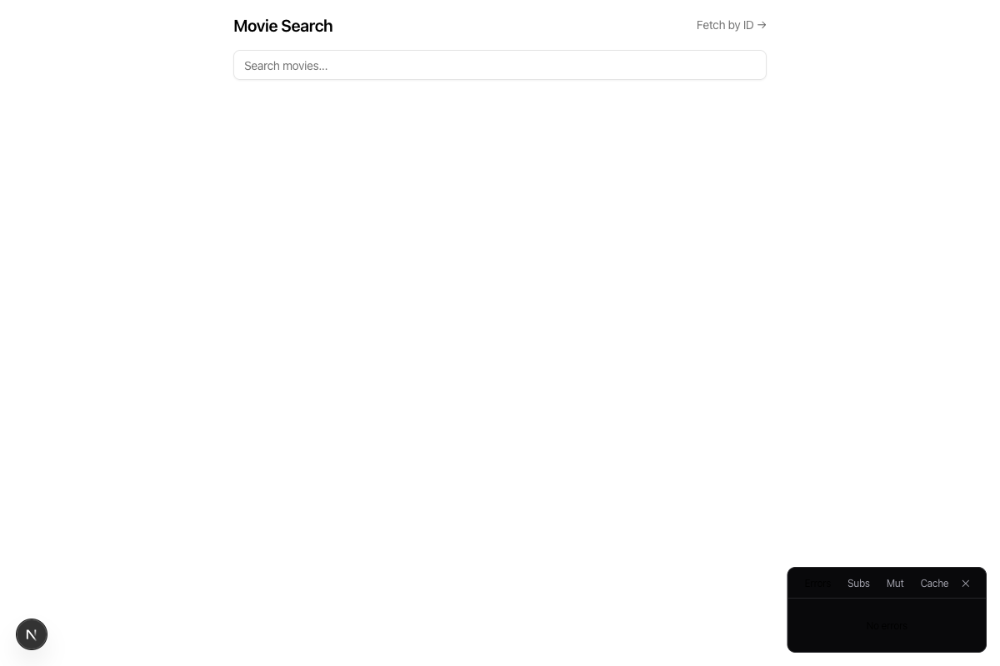
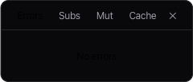

# Data Fetching

## `pub` vs `auth` — Easy Access Control Switching

Every `crud()` call generates two sets of read endpoints: `pub` (public, no auth required) and `auth` (requires authentication). Both have the same API — `list`, `read`, and optionally `search`.

```tsx
const { pub, auth, create, rm, update } = crud('blog', owned.blog)

export const { list, read } = pub   // anyone can list/read blogs
export const { list, read } = auth  // only logged-in users see blogs
```

Change access control by changing one destructure line — no endpoint rewriting, no middleware changes. Both support the same `where` clauses:

```tsx
const { pub, auth } = crud('blog', owned.blog, {
  pub: { where: { published: true } },    // public readers only see published
  auth: { where: { published: false } },   // logged-in users see drafts
})
```

## Where Clauses and Pagination

```tsx
const { items: mine, loadMore, isDone } = useList(api.blog.list, { where: { own: true } })
const published = usePaginatedQuery(api.blog.list, { where: { published: true } }, { initialNumItems: 20 })
const expensive = usePaginatedQuery(api.product.list, { where: { price: { $gte: 100 } } }, { initialNumItems: 20 })
const either = usePaginatedQuery(api.blog.list, { where: { or: [{ category: 'tech' }, { category: 'life' }] } }, { initialNumItems: 20 })
```

`{ own: true }` uses the `by_user` index automatically. Default where clauses can be set at the factory level:

```tsx
crud('blog', owned.blog, { pub: { where: { published: true } } })
```

## Search Configuration

Search is generated only when `search` is configured on `crud(...)`. Three forms:

```tsx
crud('blog', owned.blog, { search: true })            // defaults: field='text', index='search_field'
crud('blog', owned.blog, { search: 'content' })       // shorthand: search on 'content' field
crud('blog', owned.blog, { search: { field: 'content', index: 'my_index' } })  // full config
```

The string shorthand is typesafe — `search: 'conten'` is a compile error if `conten` is not a field in your schema.

You must add a matching `searchIndex` to your schema table.

## File Upload

`cvFile()` for single file, `cvFiles()` for arrays. Everything is automatic:

- Image compression (max 1920px, auto quality) — disable with `compressImg={false}`
- Auto-cleanup on doc update/delete (orphaned files removed)
- URL resolution — `photo` (storage ID) → `photoUrl` (URL string) in query results
- Rate limited (10 uploads/min), max 10MB per file

## Soft Delete + Undo Toast

> [Real example: apps/org/src/app/wiki/page.tsx — bulk delete with undo](https://github.com/1qh/lazyconvex/blob/main/apps/org/src/app/wiki/page.tsx)

```tsx
const { remove } = useSoftDelete({
  rm: useOrgMutation(api.wiki.rm),
  restore: useOrgMutation(api.wiki.restore),
  toast, label: 'wiki page',
})
await remove({ id: wikiId })
```

Bulk version:

```tsx
const { handleBulkDelete, selected, toggleSelect } = useBulkSelection({
  bulkRm: useMutation(api.wiki.bulkRm),
  items: wikis?.page ?? [],
  orgId: org._id,
  restore: useOrgMutation(api.wiki.restore),
  toast, undoLabel: 'wiki page',
})
```

Enable soft delete on any table by adding `deletedAt: number().optional()` to the schema and `softDelete: true` to the factory:

```tsx
orgCrud('wiki', orgScoped.wiki, { acl: true, softDelete: true })
```

## Singleton CRUD

For 1:1 per-user data — profiles, settings, preferences. Each user gets exactly one record.

> [Real example: packages/be/convex/blogprofile.ts](https://github.com/1qh/lazyconvex/blob/main/packages/be/convex/blogprofile.ts)

```tsx
const { get, upsert } = singletonCrud('blogProfile', singleton.blogProfile)
export { get, upsert }
```

- `get` — returns the current user's record (or `null`), with file URLs resolved
- `upsert` — creates on first call, partial-updates on subsequent calls. Handles file cleanup

```tsx
await upsert({ displayName: 'Jane', theme: 'dark' })
await upsert({ bio: 'Updated bio' }) // merges — displayName and theme preserved
```

## Child CRUD

> [Real example: packages/be/convex/message.ts](https://github.com/1qh/lazyconvex/blob/main/packages/be/convex/message.ts)

```tsx
export const { create, list, update } = childCrud('message', children.message)
```

Parent ownership verified automatically. Add `cascade` on the parent to cascade deletes:

```tsx
crud('chat', owned.chat, { cascade: [{ foreignKey: 'chatId', table: 'message' }] })
```

### Public Access for Child Resources

```tsx
const ops = childCrud('message', children.message, { pub: { parentField: 'isPublic' } })
export const { list: pubList, get: pubGet } = ops.pub
```

`pub.list` and `pub.get` check the parent document's `isPublic` field before returning data.

## External API Cache

> [Real example: packages/be/convex/movie.ts](https://github.com/1qh/lazyconvex/blob/main/packages/be/convex/movie.ts)

```tsx
const c = cacheCrud({
  table: 'movie', schema: base.movie, key: 'tmdb_id',
  fetcher: async (_, tmdbId) => {
    const { id, ...rest } = await tmdb(`/movie/${tmdbId}`, {}).json<TmdbMovie>()
    return { ...rest, tmdb_id: id }
  },
  rateLimit: { max: 30, window: 60_000 },
})
export const { all, get, load, refresh, invalidate, purge } = c
```

`load` returns cached or fetches. `refresh` force-refreshes. `purge` cleans expired entries.

## Rate Limiting

Built-in sliding window rate limiting on mutations:

```tsx
crud('blog', owned.blog, { rateLimit: { max: 10, window: 60_000 } })
```

`max` requests per `window` (ms) per authenticated user. Uses a single-row sliding window counter per user+table (no write amplification). Returns `RATE_LIMITED` error code when exceeded. Requires `...rateLimitTable()` in schema.

## Browser Devtools Panel

In dev mode, the devtools panel auto-mounts inside `<Form>` components. It tracks subscriptions, mutations, cache, and errors in real time.





For standalone usage:

```tsx
import { LazyConvexDevtools } from 'lazyconvex/react'

<LazyConvexDevtools position='bottom-right' defaultTab='subs' />
```
